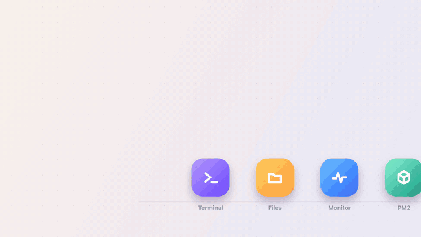
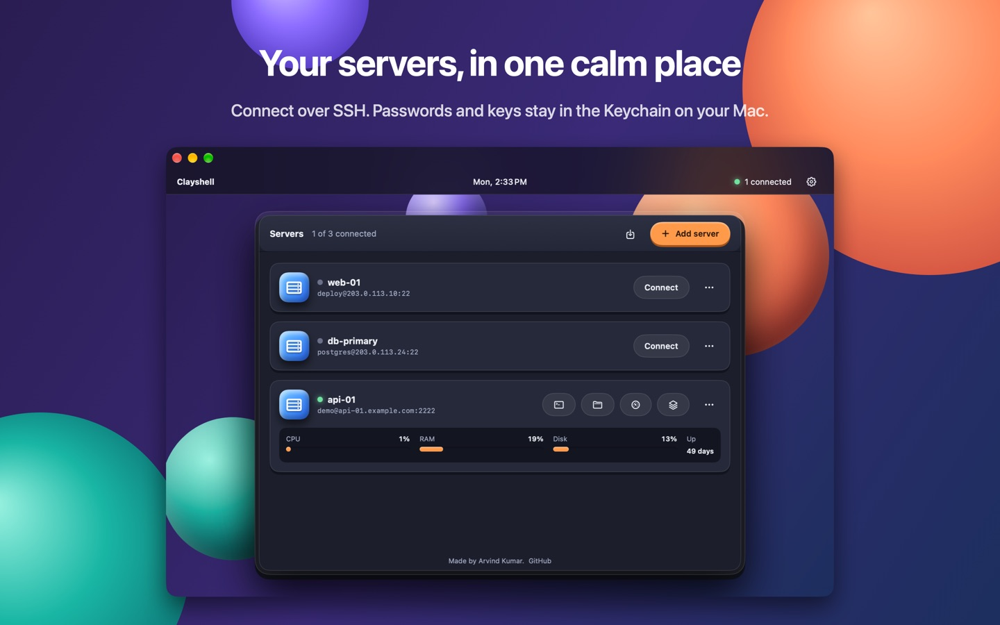
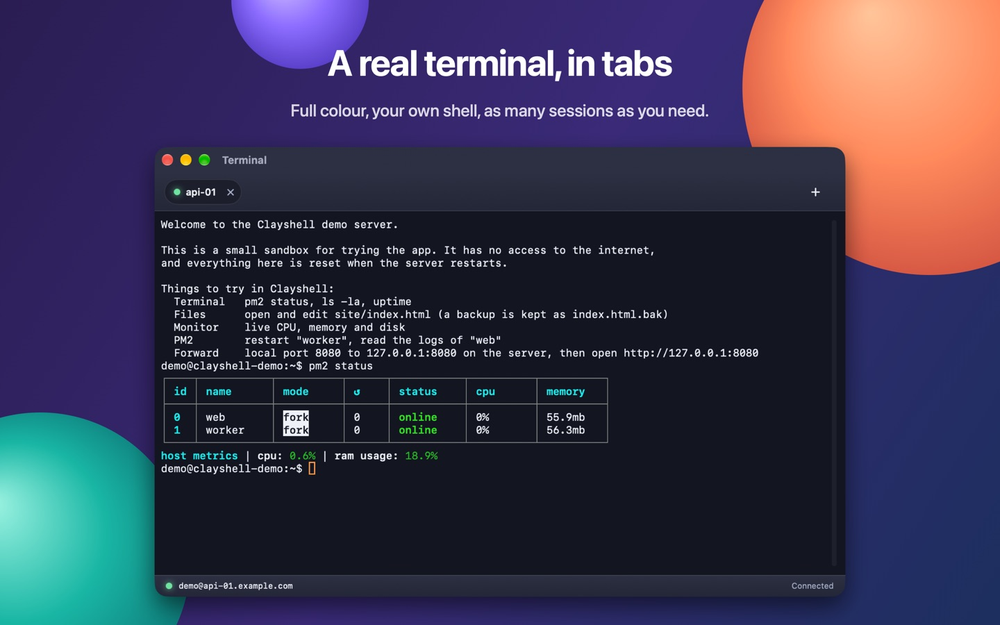
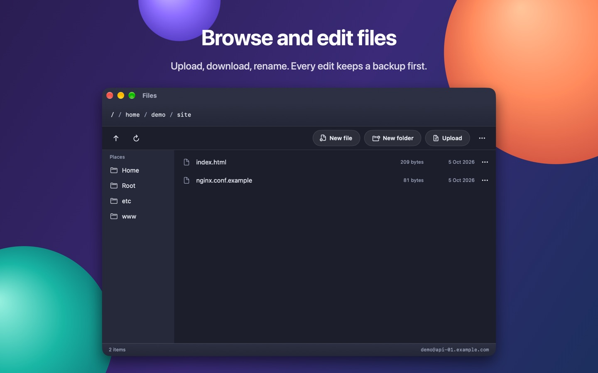
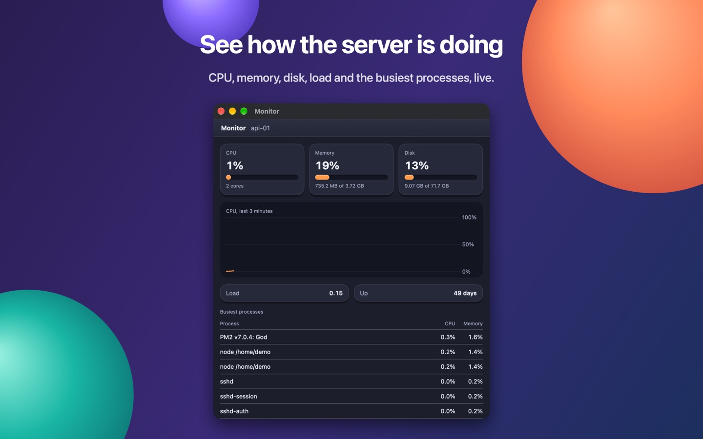
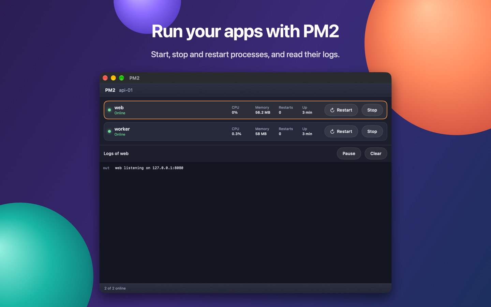
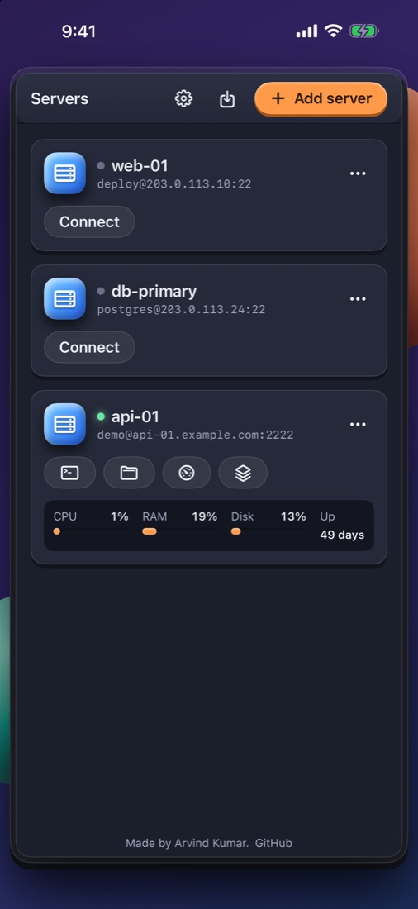
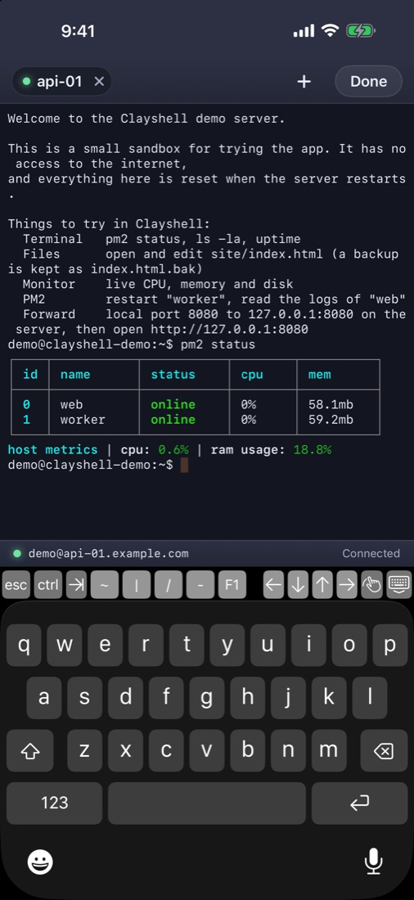
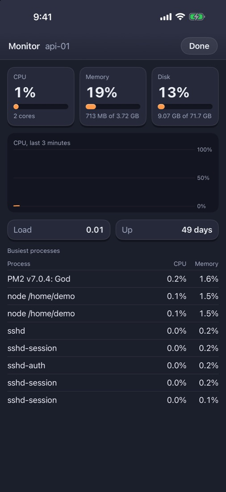
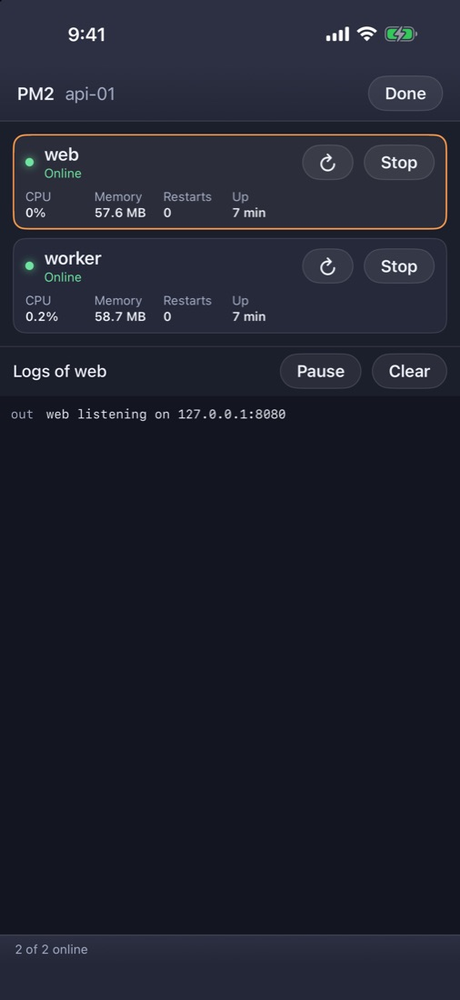

<h1 align="center">Clayshell</h1>

<b>Your servers, in one calm place.</b> An SSH server manager for Mac and iPhone.

<a href="https://clayshell.opendmg.app">Website</a> · <a href="https://clayshell.opendmg.app/privacy">Privacy</a> · <a href="https://clayshell.opendmg.app/support">Support</a>

> **Status:** version 1.0 is in App Review. It will be free on the App Store for Mac and iPhone. This page will get the link when it is out.

## What it does

| | |
|---|---|
| **Terminal** | A real terminal with full colour, in tabs. |
| **Files** | Browse the server over SFTP. Upload, download, rename, delete, make files and folders, preview text files. |
| **Editor with a backup** | Edit a file on the server. Before every save the old version is kept next to it as a `.bak` file, and one tap puts it back. |
| **Monitor** | CPU, memory, disk, load, uptime and the busiest processes, live, for Linux servers. |
| **PM2** | See your processes, start, stop and restart them, follow their logs. |
| **Alerts** | Disk filling up, CPU or memory staying high, a PM2 process down, a server out of reach. On the Mac from the menu bar; or from a small script on the server itself, to Telegram, ntfy or a webhook. |
| **More SSH** | Jump hosts, import from your SSH config, port forwarding, Ed25519 / ECDSA / RSA keys or a password. |

## Your data stays with you

- No account, no analytics, no tracking. Nothing is sent to the maker.
- Passwords and keys are kept in the Keychain on your device, and are not synced.
- Clayshell only talks to the servers you add.
- It asks before trusting a new server, and stops if a server's key changes.
- The Mac app is sandboxed. An optional lock uses Face ID, Touch ID or your passcode.

The full [privacy policy](https://clayshell.opendmg.app/privacy) is one page.

## Screenshots

**Mac**

 

  

**iPhone**

   

## Good to know

- Needs macOS 15 or iOS 18.
- Monitoring needs a Linux server. The PM2 screen needs PM2 on the server. Server alerts need `curl` and `cron` there.
- An RSA key protected by a passphrase is not supported yet; use Ed25519, or an RSA key without a passphrase.
- The iPhone app runs on iPad in iPhone mode for now. iCloud sync is not in 1.0.

## Questions and problems

Open an [issue](https://github.com/aarvnd/Clayshell/issues) here, or write to clayshell@opendmg.app. Please do not post passwords or private keys.

## About this repository

This repository is Clayshell's public page: news, releases and issues. The app's source code is not here.

Clayshell is built with SwiftUI and these open-source libraries: Citadel, swift-nio, swift-nio-ssh, swift-crypto, swift-log, SwiftTerm and BigInt. Their licences are shown in the app under Settings, Acknowledgements.

The two films on this page were made with [onetake](https://github.com/feitangyuan/onetake).

Made by [Arvind Kumar](https://github.com/aarvnd).
